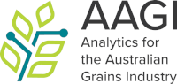
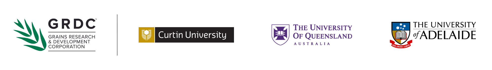

## Analytics for the Australian Grains Industry (AAGI) 

Analytics for the Australian Grains Industry (AAGI) is a five-year strategic partnership aimed at harnessing analytics to drive the sector’s profitability and global competitiveness.

This GitHub organisation is the home for the AAGI project's privately accessible tools and resources that can only be shared within development teams.

AAGI is led by three strategic partners: [Curtin University](https://curtin.edu.au), [University of Queensland](https://www.uq.edu.au/), and [University of Adelaide](https://www.adelaide.edu.au/) along with the Grains Research and Development Corporation.
The strategic partners work with project and associate partner organisations that include leading Australian and international universities, federal and state government research agencies, and commercial technology and analytics providers, to expand the sector’s analytics capability and tackle the Australian grains industry’s biggest challenges.

<!--

**Here are some ideas to get you started:**

🙋‍♀️ A short introduction - what is your organization all about?
🌈 Contribution guidelines - how can the community get involved?
👩‍💻 Useful resources - where can the community find your docs? Is there anything else the community should know?
🍿 Fun facts - what does your team eat for breakfast?
🧙 Remember, you can do mighty things with the power of [Markdown](https://docs.github.com/github/writing-on-github/getting-started-with-writing-and-formatting-on-github/basic-writing-and-formatting-syntax)
-->
